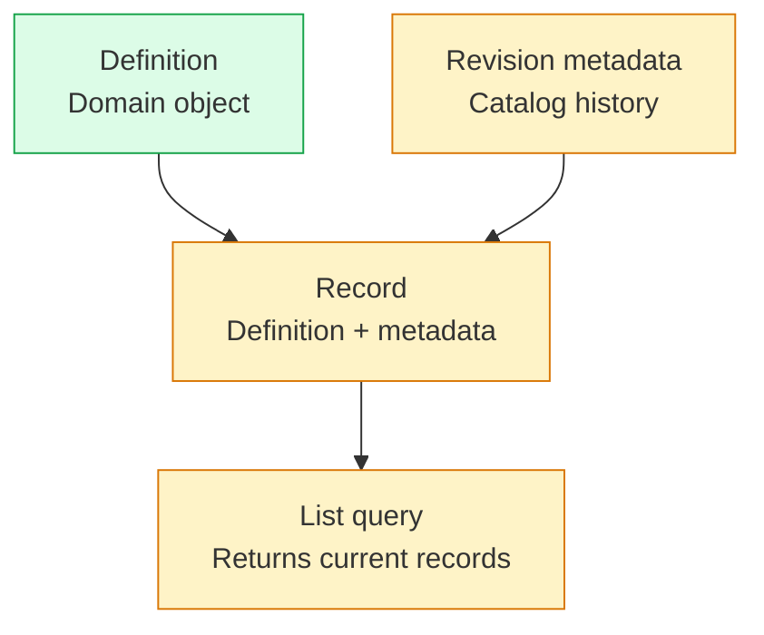
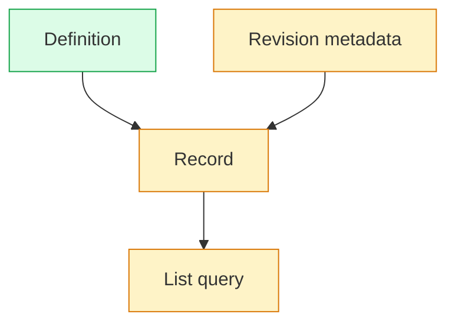
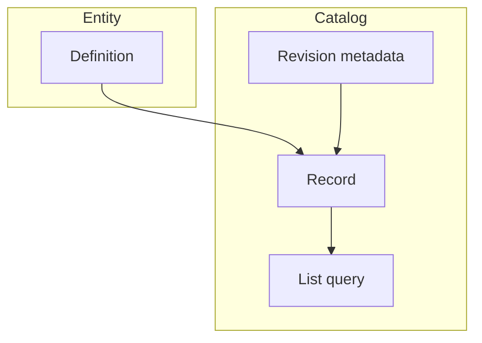

# Mermaid Diagram Style

When producing Mermaid diagrams, prefer **semantic color coding** over large enclosing boxes.

## Rules

1. Do not use `subgraph` merely to visually group related nodes.
2. Represent architectural categories, layers, or roles using semantic classes and colors instead.
3. Prefer `classDef` + `class` over repeated per-node `style` declarations.
4. Use the same class for nodes belonging to the same semantic category.
5. Keep external actors visually distinct from internal components when useful.
6. Preserve the actual topology of the system. Styling must not distort relationships.
7. Avoid decorative containers, legends, and borders when the same information can be conveyed through semantic classes.
8. Use `subgraph` only when the boundary itself has architectural meaning, for example:
   - a deployment boundary
   - a process boundary
   - a trust/security boundary
   - a machine or cluster boundary
   - another boundary explicitly relevant to understanding the system
9. Prefer a small number of visually distinct categories, typically 2–5.
10. Choose colors creatively based on the diagram and its semantics.
11. Prefer restrained, tasteful colors over highly saturated, neon, or flashy palettes.
12. Ensure sufficient contrast between node text, fills, and borders.
13. Give classes semantic names such as `entity`, `transport`, `storage`, `catalog`, `external`, or `engine`, rather than names based on their colors.

## Preferred Pattern

<allowed pattern>
**Prefer**:


</allowed_pattern>

<forbidden_pattern>
Instead of:



And especially avoid:


</forbidden_pattern>

Only the first form is allowed because:

1. The styling expresses semantic grouping directly without cluttering the graph with large enclosing containers or
repetitive styling declarations.
2. This is the only form that allows the renderer to render the legend properly

## Class Design

Define one `classDef` per meaningful semantic category.

For example:

```mermaid id="2diinx"
classDef external fill:#e2e8f0,stroke:#64748b
classDef transport fill:#dbeafe,stroke:#3b82f6
classDef engine fill:#dcfce7,stroke:#22c55e
classDef storage fill:#fef3c7,stroke:#d97706
```

Then assign nodes compactly:

```mermaid id="0v7l6r"
class Client external
class Api,Ingress transport
class Processor,Dispatcher engine
class Database storage
```

Prefer:

```text
class A,B,C engine
```

over repeating:

```text
class A engine
class B engine
class C engine
```

when the nodes share the same class.

## Color Selection

Do not follow a fixed palette.

Choose colors appropriate to the specific diagram and feel free to vary them between diagrams.

Favor:

- muted or moderately saturated colors
- harmonious combinations
- clearly distinguishable semantic groups

Avoid:

- neon colors
- excessively saturated palettes
- unnecessary rainbow-like variation
- giving every node a different color without semantic reason

Color should reinforce semantic structure rather than become the main visual focus.

## Existing Diagrams

When rewriting an existing Mermaid diagram:

1. Identify what each `subgraph` is trying to communicate.
2. If it merely groups similar components, remove it.
3. Create a semantic `classDef` for that category.
4. Assign the relevant nodes to that class.
5. Preserve nodes, edges, labels, and direction unless the user asks for structural changes.
6. Retain a `subgraph` when removing it would erase a meaningful system boundary.

The goal is to make diagrams communicate **architecture through topology and semantic classes**, rather than through large enclosing rectangles.
